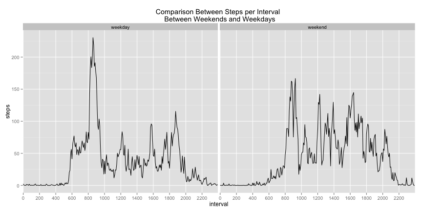

### Loading and preprocessing the data

Load the data and have a quick look at it.


```r
activity<-read.csv("activity.csv",sep=",",header=TRUE)
```

```
## Warning: cannot open file 'activity.csv': No such file or directory
```

```
## Error: cannot open the connection
```

Have a quick look at the data


```r
head(activity)
```

```
##   steps       date interval
## 1    NA 2012-10-01        0
## 2    NA 2012-10-01        5
## 3    NA 2012-10-01       10
## 4    NA 2012-10-01       15
## 5    NA 2012-10-01       20
## 6    NA 2012-10-01       25
```

Change the data types to assist with the analysis
- Change date from string to POSIXlt object


```r
activity$date<-as.POSIXlt(activity$date,format='%Y-%m-%d')
```


### What is mean total number of steps taken per day?

Ignoring missing values make a histogram of the total number of steps taken each day


```r
daymonthMatrix<-with(activity,tapply(steps,list(format(date,format='%m'),date$mday),sum))
daymonthDF<-as.data.frame(as.table(daymonthMatrix))
colnames(daymonthDF)<-c("Month","Day", "TotalSteps")
daymonthDF<-daymonthDF[order(daymonthDF$Month,daymonthDF$Day),]
daymonthDF<-daymonthDF[!is.na(daymonthDF$TotalSteps),]
hist(daymonthDF$TotalSteps,col="red",breaks=6,xlab="Total Number of Steps",main="Histogram depicting total number of steps per day")
```

 


Mean of the total number of steps taken per day

```r
mean(daymonthDF$TotalSteps)
```

```
## [1] 10766
```

Median of the total number of steps taken per day

```r
median(daymonthDF$TotalSteps)
```

```
## [1] 10765
```

### What is the average daily activity pattern?

Τime series plot of the 5-minute interval (x-axis) and the average number of steps taken, averaged across all days (y-axis)


```r
avgintervalMatrix<-with(activity,tapply(steps,list(interval),mean,na.rm=TRUE))
avgintervalDF<-as.data.frame(as.table(avgintervalMatrix))
colnames(avgintervalDF)<-c("interval","avg_steps")

avgintervalDF$interval<-as.integer(levels(avgintervalDF$interval))
plot(avgintervalDF$interval,avgintervalDF$avg_steps,ylab="Average number of steps",xlab="5 min intevals",col="red",type="l")
```

 

Which 5-minute interval, on average across all the days in the dataset, contains the maximum number of steps?


```r
avgintervalDF[avgintervalDF$avg_steps==max(avgintervalDF$avg_steps),]
```

```
##     interval avg_steps
## 104      835     206.2
```

### Inputing missing values

Total number of missing values in the dataset (i.e. the total number of rows with NAs)


```r
nrow(activity[is.na(activity$steps),])
```

```
## [1] 2304
```

Strategy for filling in all of the missing values in the dataset: Use the mean for that 5-minute interval.


```r
activity_complete<- merge(activity,avgintervalDF,by="interval")
activity_complete<-activity_complete[order(activity_complete$date,activity_complete$interval),]
for(i in 1:nrow(activity_complete)){
    if(is.na(activity_complete[i,"steps"])){
        activity_complete[i,"steps"]<-activity_complete[i,"avg_steps"]
        }
    }
activity_complete<-activity_complete[,c("steps","date","interval")]
 head(activity_complete)
```

```
##       steps       date interval
## 1   1.71698 2012-10-01        0
## 63  0.33962 2012-10-01        5
## 128 0.13208 2012-10-01       10
## 205 0.15094 2012-10-01       15
## 264 0.07547 2012-10-01       20
## 327 2.09434 2012-10-01       25
```
Create a new dataset that is equal to the original dataset but with the missing data filled in.

```r
activity_new<-activity_complete[,c("steps","date","interval")]
head(activity_new)
```

```
##       steps       date interval
## 1   1.71698 2012-10-01        0
## 63  0.33962 2012-10-01        5
## 128 0.13208 2012-10-01       10
## 205 0.15094 2012-10-01       15
## 264 0.07547 2012-10-01       20
## 327 2.09434 2012-10-01       25
```

Remake histogram of the total number of steps taken each day.


```r
daymonthMatrix<-with(activity_new,tapply(steps,list(format(date,format='%m'),date$mday),sum))
daymonthDF<-as.data.frame(as.table(daymonthMatrix))
colnames(daymonthDF)<-c("Month","Day", "TotalSteps")
daymonthDF<-daymonthDF[order(daymonthDF$Month,daymonthDF$Day),]
daymonthDF<-daymonthDF[!is.na(daymonthDF$TotalSteps),]
hist(daymonthDF$TotalSteps,col="red",breaks=6,xlab="Total Number of Steps",main="Histogram depicting total number of steps/day for complete dataset")
```

 

Mean of the total number of steps taken per day

```r
mean(daymonthDF$TotalSteps)
```

```
## [1] 10766
```

Median of the total number of steps taken per day

```r
median(daymonthDF$TotalSteps)
```

```
## [1] 10766
```

The mean and median of the total number of steps remains rougly the same. From the two histograms it is apparent that the distribution is similar but the frequency of observed events is higher.

###Are there differences in activity patterns between weekdays and weekends?


```r
weekdayMatrix<-with(activity_new,tapply(steps,list(format(date,format='%a'),interval),mean))
weekdayDF<-as.data.frame(as.table(weekdayMatrix))
colnames(weekdayDF)<-c("day","interval","steps")
head(weekdayDF)
```

```
##   day interval  steps
## 1 Fri        0 0.3816
## 2 Mon        0 1.4927
## 3 Sat        0 0.2146
## 4 Sun        0 0.2146
## 5 Thu        0 5.4130
## 6 Tue        0 0.0000
```

Create a new factor variable in the dataset with two levels – “weekday” and “weekend” indicating whether a given date is a weekday or weekend day.

```r
dtype<-c()
weekdayDF$day<-as.character(weekdayDF$day)
for(j in 1:nrow(weekdayDF)){
    if(weekdayDF[j,"day"]=="Sat"){
        dtype<-c(dtype,"weekend")
    }
    else if(weekdayDF[j,"day"]=="Sun"){
        dtype<-c(dtype,"weekend")
    }
    else{
        dtype<-c(dtype,"weekday")
    }
}
weekdayDF["day_type"]<-dtype
head(weekdayDF,7)
```

```
##   day interval  steps day_type
## 1 Fri        0 0.3816  weekday
## 2 Mon        0 1.4927  weekday
## 3 Sat        0 0.2146  weekend
## 4 Sun        0 0.2146  weekend
## 5 Thu        0 5.4130  weekday
## 6 Tue        0 0.0000  weekday
## 7 Wed        0 3.9686  weekday
```


Calculate average steps depending on type of day


```r
daytypeMatrix<-with(weekdayDF,tapply(steps,list(day_type,interval),mean))
daytypeDF<-as.data.frame(as.table(daytypeMatrix))
colnames(daytypeDF)<-c("day_type","interval","steps")
head(daytypeDF)
```

```
##   day_type interval   steps
## 1  weekday        0 2.25115
## 2  weekend        0 0.21462
## 3  weekday        5 0.44528
## 4  weekend        5 0.04245
## 5  weekday       10 0.17317
## 6  weekend       10 0.01651
```


Panel plot containing a time series plot of the 5-minute interval (x-axis) and the average number of steps taken, averaged across all weekday days or weekend days (y-axis).

```r
library(ggplot2)

ggplot(daytypeDF, aes(x=interval, y=steps, group=day_type)) +
    labs(title="Comparison Between Steps per Interval \n Between Weekends and Weekdays")+
    scale_x_discrete(breaks = seq(from = 0, to = 2355, by = 200))+
    facet_grid(.~ day_type) +
geom_line()+
    ylab("steps")
```

 

